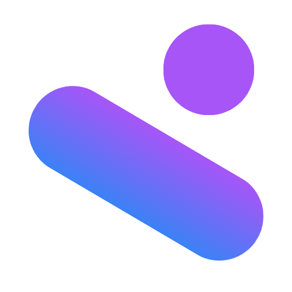
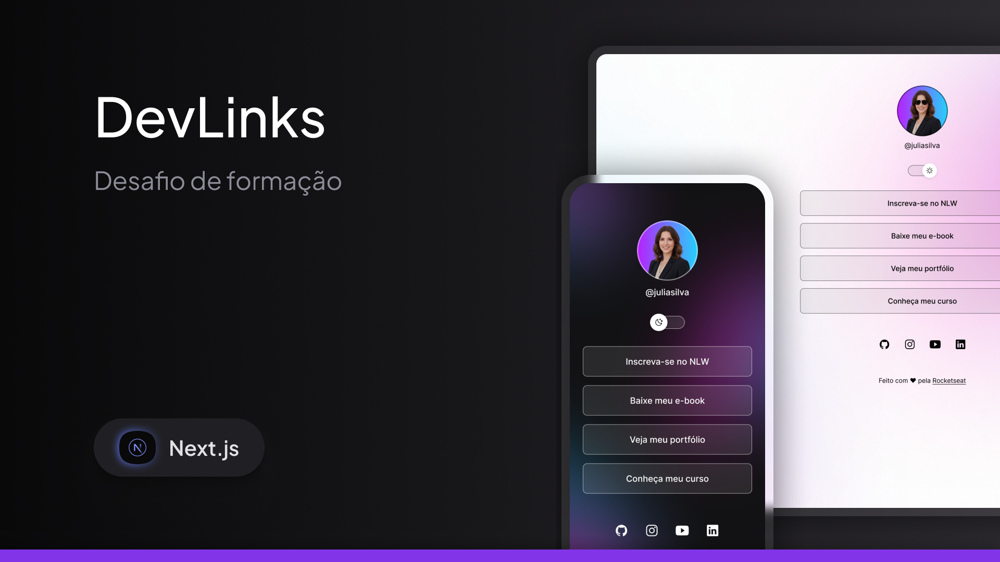

<h1 align="center">
  
  <br />
  <p>DevLinks</p>
  <p>
    
    
    
  </p>
</h1>

**DevLinks** é uma página pessoal de links desenvolvida com **Next.js**, **React**, **TypeScript** e **Tailwind CSS**. A aplicação centraliza o acesso ao portfólio, currículo, contato e redes sociais em uma interface responsiva com temas claro e escuro.

---

## 📸 Visualização do projeto

<p align="center">
  
</p>

---

## 🚀 Funcionalidades

| Funcionalidade | Descrição |
| --- | --- |
| 🌓 **Tema claro e escuro** | Alternância de tema com atualização das cores, avatar e imagem de fundo |
| 🔗 **Links profissionais** | Acesso rápido ao portfólio, LinkedIn e contato por e-mail |
| 📄 **Download do currículo** | Download direto do currículo em PDF |
| 🌐 **Redes sociais** | Links externos para GitHub, Instagram e LinkedIn |
| 📱 **Layout responsivo** | Interface adaptada para dispositivos móveis e desktops |
| ♿ **Acessibilidade** | Rótulos descritivos e estilos de foco para navegação por teclado |

---

## 🛠️ Tecnologias utilizadas

<div align="center">
  
  
  
  
  
</div>

---

## 📚 Conceitos aplicados

- Next.js com App Router
- Componentização com React
- TypeScript para tipagem dos componentes
- Tailwind CSS com tokens personalizados
- Tema claro e escuro com estado local
- Layout responsivo para mobile e desktop
- Otimização de imagens com `next/image`
- Assets estáticos servidos pela pasta `public`
- Links externos seguros com `noopener noreferrer`
- Download de arquivo PDF pelo navegador

---

## ▶️ Como rodar o projeto

### Pré-requisitos

- [Node.js](https://nodejs.org/) 20 ou superior
- npm

### Instalação

```bash
# Clone o repositório
git clone [URL_DO_REPOSITORIO](https://github.com/DanielVerissimo1/devLinks.git)

# Entre na pasta do projeto
cd devLinks

# Instale as dependências
npm install

# Inicie o servidor de desenvolvimento
npm run dev
```

Acesse [http://localhost:3000](http://localhost:3000) no navegador.

### Outros comandos

```bash
# Verificar o código com ESLint
npm run lint

# Verificar os tipos do TypeScript
npm run typecheck

# Gerar o build de produção
npm run build

# Executar o build de produção
npm start
```

---

## 📁 Arquitetura do projeto

```text
devLinks/
├── public/
│   ├── assets/
│   │   ├── figma/                   # Avatares e fundos dos temas
│   │   └── icons/                   # Ícones das redes sociais
│   ├── Daniel Verissimo - Font-End.pdf
│   └── Thumbnail.png                # Preview da aplicação
│
├── src/
│   ├── app/
│   │   ├── globals.css              # Estilos globais e tokens do tema
│   │   ├── icon.png                 # Ícone da aplicação
│   │   ├── layout.tsx               # Layout raiz e metadados
│   │   └── page.tsx                 # Página inicial
│   │
│   ├── components/
│   │   ├── sections/
│   │   │   ├── links-section.tsx
│   │   │   ├── profile-section.tsx
│   │   │   └── social-links-section.tsx
│   │   ├── ui/                      # Componentes reutilizáveis
│   │   └── devlinks-page.tsx        # Composição principal da página
│   │
│   ├── lib/
│   │   └── cn.ts                    # Utilitário para classes CSS
│   └── types/
│       └── theme.ts                 # Tipagem dos temas
│
├── next.config.ts
├── package.json
├── postcss.config.mjs
├── tsconfig.json
└── README.md
```

---

## 👨‍💻 Autor

<p align="center">
  
  <br />
  <strong>Daniel Verissimo</strong>
  <br />
  Desenvolvedor Front-End
</p>

<p align="center">
  <a href="https://linkedin.com/in/daniel-verissimo">
    
  </a>
  <a href="https://github.com/DanielVerissimo1">
    
  </a>
  <a href="https://daniel-verissimodev.vercel.app/">
    
  </a>
  <a href="mailto:danielsantoss1300@gmail.com">
    
  </a>
</p>

---

<p align="center">Feito por <strong>Daniel Verissimo</strong></p>
